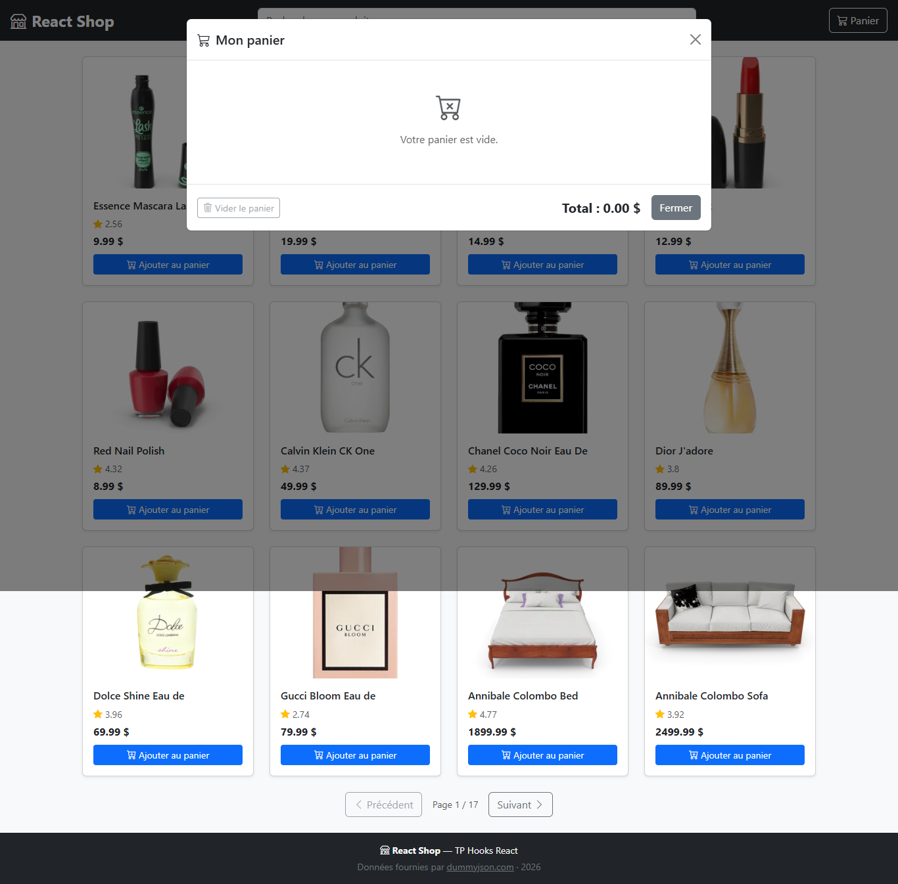
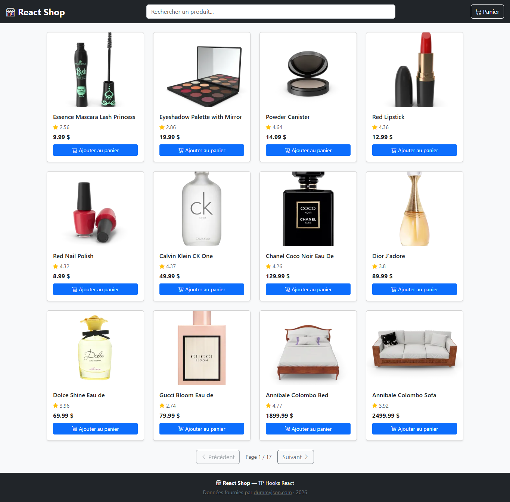
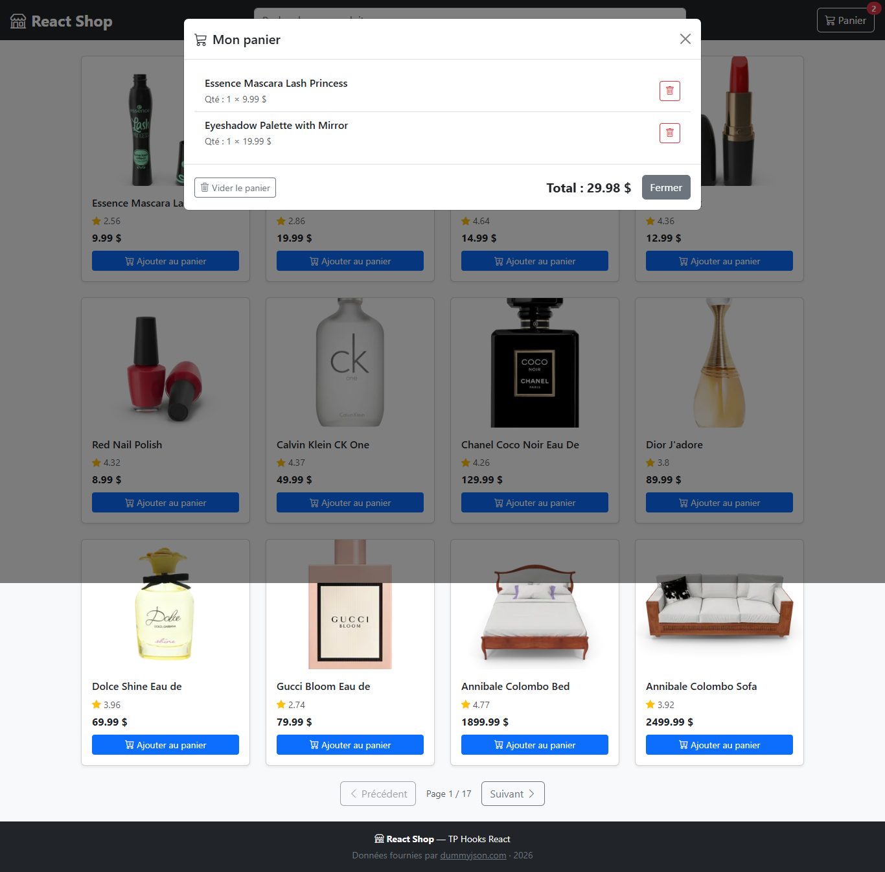
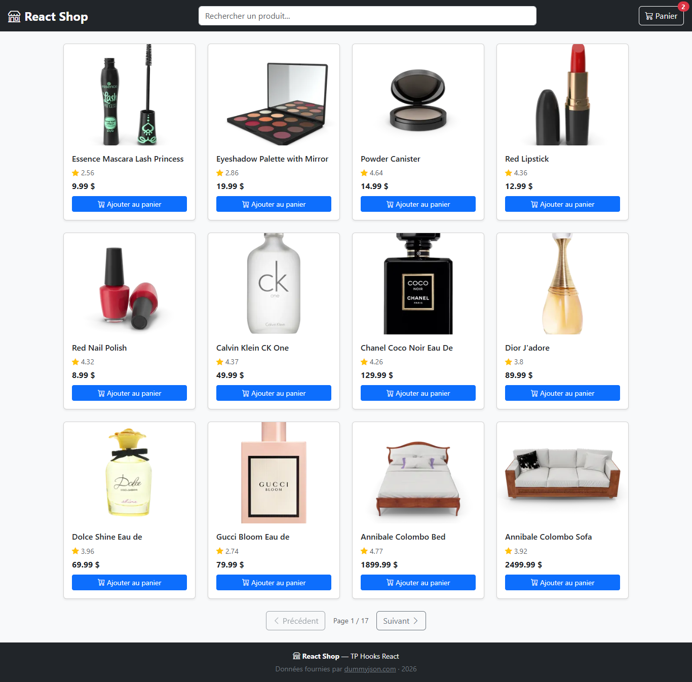

# React Shop — TP Hooks React

Boutique en ligne pédagogique pour mettre en œuvre les hooks React fondamentaux :
`useState` · `useEffect` · `useContext` · `useCallback` · `useMemo` · hooks personnalisés.

---

## Mise en place

### 1. Cloner le dépôt

```bash
git clone https://github.com/<organisation>/react-shop-tp.git
cd react-shop-tp
```

### 2. Installer les dépendances

```bash
npm install
```

### 3. Lancer le serveur de développement

```bash
npm run dev
```

Ouvrir [http://localhost:5173](http://localhost:5173) dans le navigateur.  
Vous devez voir la NavBar « React Shop », une zone principale vide et le Footer.

---

## Restitution du travail

À la fin de chaque étape, effectuer un commit avec le message indiqué.  
À la fin du TP, pousser votre travail sur la branche `main` :

```bash
git push origin main
```

> Pour chaque question ci-dessous, **compléter ce fichier README.md**
> avec votre réponse : capture d'écran, extrait de code ou explication.  
> Remplacer les blocs `<!-- RÉPONSE -->` par votre contenu.

---

## Étape 1 — `useState` : état de l'application

**Fichier à modifier :** `src/App.jsx`

Remplacer les trois variables figées par de vrais appels `useState`, puis câbler
les callbacks `onSearchChange`, `onCartClick`, `onPageChange` et `onClose`.

**Commit :** `step1: wire App state with useState`

---

### Q1.1 — À quoi sert le hook `useState` ?

Expliquer en 2-3 phrases le rôle de `useState` et pourquoi React nécessite ce
hook plutôt qu'une simple variable JavaScript.

`useState` sert à déclarer une donnée qui appartient à l'état d'un composant et à déclencher un nouveau rendu quand cette donnée change. Une simple variable JavaScript est réinitialisée à chaque rendu et sa modification ne prévient pas React qu'il doit mettre l'interface à jour. Avec `useState`, React conserve la valeur entre les rendus et applique les changements de manière contrôlée.

---

### Q1.2 — Montrer votre implémentation des trois `useState`

Coller ici l'extrait de code correspondant aux trois déclarations d'état dans `App.jsx`.

```jsx
const [searchQuery, setSearchQuery] = useState('')
const [isCartOpen, setIsCartOpen] = useState(false)
const [currentPage, setCurrentPage] = useState(1)

```

---

### Q1.3 — Capture d'écran : la modale s'ouvre et se ferme

Cliquer sur le bouton « Panier » puis sur « Fermer ».  
Joindre une capture montrant la modale ouverte (panier vide).



---

## Étape 2 — Composants `ProductCard` et `ProductList`

**Fichiers à modifier :** `src/components/ProductCard/ProductCard.jsx`  
et `src/components/ProductList/ProductList.jsx`

1. Dans `ProductCard`, câbler le `onClick` du bouton « Ajouter au panier ».
2. Dans `ProductList`, remplacer le texte TODO par la grille Bootstrap de `ProductCard`.

> Pour tester sans l'API, utiliser ces données fictives dans `ProductList` :
>
> ```js
> const products = [
>   { id: 1, title: 'Produit test', price: 9.99, thumbnail: 'https://placehold.co/300x200', rating: 4.5 }
> ]
> ```

**Commit :** `step2: render ProductCard with Add to Cart`

---

### Q2.1 — Qu'est-ce que le « props drilling » ?

Expliquer en 2-3 phrases. Pourquoi pose-t-il problème quand l'arbre de composants est profond ?

Le props drilling consiste à faire passer une donnée ou une fonction de composant en composant via les props, même quand certains composants intermédiaires ne l'utilisent pas directement. Dans un arbre profond, cela rend le code plus verbeux et plus fragile, car chaque niveau doit connaître et transmettre des props qui ne le concernent pas.

---

### Q2.2 — Montrer le rendu de la grille

Coller ici la partie JSX du `.map()` dans `ProductList`.

```jsx
<div className="row row-cols-1 row-cols-md-3 row-cols-lg-4 g-4">
  {products.map((product) => (
    <div key={product.id} className="col">
      <ProductCard product={product} onAddToCart={addToCart} />
    </div>
  ))}
</div>

```

---

### Q2.3 — Capture d'écran : la grille avec le produit fictif



---

## Étape 3 — `useEffect` : chargement des données

**Fichier à modifier :** `src/hooks/useProducts.js`  
et `src/components/ProductList/ProductList.jsx` (brancher le hook + Pagination)

Implémenter `useProducts(searchQuery, page)` qui récupère les produits depuis :

- `https://dummyjson.com/products?limit=12&skip=N` (navigation)
- `https://dummyjson.com/products/search?q=MOT&limit=12&skip=N` (recherche)

**Commit :** `step3: fetch products with useEffect, pagination`

---

### Q3.1 — Pourquoi utiliser `useEffect` pour les appels réseau ?

Expliquer pourquoi on ne peut pas placer un `fetch()` directement dans le corps
du composant (ou du hook). Quel problème cela provoquerait-il ?

Un appel réseau est un effet de bord: il dépend de l'extérieur du composant et modifie l'état après coup. Si on place `fetch()` directement dans le corps du composant, il est relancé à chaque rendu; comme la réponse met à jour l'état, cela peut provoquer une boucle de rendus et de requêtes. `useEffect` permet de déclencher l'appel uniquement quand les dépendances utiles changent.

---

### Q3.2 — Quel est le rôle du tableau de dépendances `[searchQuery, page]` ?

Que se passerait-il si ce tableau était vide `[]` ?  
Et si on l'omettait complètement ?

Le tableau `[searchQuery, page]` indique à React de relancer l'effet quand la recherche ou la page courante change. Avec `[]`, les produits seraient chargés seulement au montage du hook: une nouvelle recherche ou un changement de page ne déclencherait plus d'appel API. Sans tableau de dépendances, l'effet se lancerait après chaque rendu, ce qui multiplierait inutilement les requêtes.

---

### Q3.3 — Montrer votre implémentation du `useEffect` dans `useProducts`

```js
useEffect(() => {
  const controller = new AbortController()

  async function loadProducts() {
    setLoading(true)
    setError(null)

    const skip = (page - 1) * PAGE_SIZE
    const trimmedQuery = searchQuery.trim()
    const params = new URLSearchParams({
      limit: String(PAGE_SIZE),
      skip: String(skip),
    })

    const url = trimmedQuery
      ? `${BASE_URL}/search?q=${encodeURIComponent(trimmedQuery)}&${params}`
      : `${BASE_URL}?${params}`

    try {
      const response = await fetch(url, { signal: controller.signal })

      if (!response.ok) {
        throw new Error('Impossible de charger les produits.')
      }

      const data = await response.json()
      setProducts(data.products ?? [])
      setTotal(data.total ?? 0)
    } catch (err) {
      if (err.name !== 'AbortError') {
        setProducts([])
        setTotal(0)
        setError(err.message)
      }
    } finally {
      if (!controller.signal.aborted) {
        setLoading(false)
      }
    }
  }

  loadProducts()

  return () => {
    controller.abort()
  }
}, [searchQuery, page])

```

---

### Q3.4 — Capture d'écran : les produits s'affichent, la pagination fonctionne

Joindre une capture montrant la page 2 chargée.


---

## Étape 4 — Hook personnalisé `useDebounce`

**Fichier à modifier :** `src/hooks/useDebounce.js` et `src/App.jsx`

Implémenter `useDebounce(value, delay)` puis l'utiliser dans `App.jsx` :

```js
const debouncedQuery = useDebounce(searchQuery, 400)
```

Passer `debouncedQuery` (et non `searchQuery`) à `ProductList`.

**Commit :** `step4: add useDebounce custom hook`

---

### Q4.1 — Qu'est-ce que le debounce et pourquoi est-il utile ici ?

Décrire ce qui se passerait sans debounce quand l'utilisateur tape rapidement.

Le debounce consiste à attendre une courte pause avant de valider une valeur qui change souvent. Ici, quand l'utilisateur tape rapidement dans la recherche, on évite d'envoyer une requête API pour chaque lettre. Sans debounce, taper `phone` pourrait déclencher plusieurs appels successifs: `p`, `ph`, `pho`, `phon`, puis `phone`.

---

### Q4.2 — Quel est le rôle de la fonction de nettoyage (cleanup) retournée par `useEffect` ?

Expliquer pourquoi `return () => clearTimeout(timer)` est indispensable dans ce cas précis.

La fonction de nettoyage annule le timer précédent quand la valeur change avant la fin du délai. Sans `clearTimeout(timer)`, chaque frappe garderait son propre timer actif et mettrait quand même à jour la valeur débouncée plus tard. Le debounce ne fonctionnerait donc plus correctement, car plusieurs anciennes valeurs pourraient déclencher des recherches.

---

### Q4.3 — Montrer votre implémentation complète de `useDebounce`

```js
export function useDebounce(value, delay) {
  const [debouncedValue, setDebouncedValue] = useState(value)

  useEffect(() => {
    const timer = setTimeout(() => {
      setDebouncedValue(value)
    }, delay)

    return () => {
      clearTimeout(timer)
    }
  }, [value, delay])

  return debouncedValue
}

```

---

### Q4.4 — Preuve du debounce dans les DevTools réseau

Ouvrir l'onglet Réseau du navigateur, taper rapidement « phone » lettre par lettre.
Joindre une capture montrant qu'une seule requête est envoyée après la pause.


---

## Étape 5 — Hook personnalisé `useCart` : `useCallback` + `useMemo`

**Fichiers à modifier :** `src/hooks/useCart.js` et `src/context/CartContext.jsx`

Implémenter `useCart()` avec :

- `useState` pour l'état du panier (initialisé depuis `localStorage`)
- `useEffect` pour synchroniser le panier vers `localStorage`
- `addToCart`, `removeFromCart`, `clearCart` avec `useCallback`
- `cartCount` et `cartTotal` avec `useMemo`

Puis brancher `useCart()` dans `CartContext.jsx`.

**Commit :** `step5: implement useCart with localStorage`

---

### Q5.1 — Pourquoi utiliser `useCallback` pour `addToCart`, `removeFromCart` et `clearCart` ?

Quel problème survient si ces fonctions sont recréées à chaque rendu ?
En quoi cela est-il particulièrement problématique quand elles sont passées via un contexte ?

`useCallback` mémorise les fonctions tant que leurs dépendances ne changent pas. Si `addToCart`, `removeFromCart` et `clearCart` étaient recréées à chaque rendu, la valeur fournie par le contexte changerait plus souvent et pourrait provoquer des rendus inutiles chez les composants consommateurs. C'est particulièrement important avec un contexte, car plusieurs composants peuvent dépendre de ces fonctions.

---

### Q5.2 — Pourquoi utiliser `useMemo` pour `cartCount` et `cartTotal` ?

Quelle est la différence entre `useMemo` et `useCallback` ?

`useMemo` évite de recalculer `cartCount` et `cartTotal` tant que le panier n'a pas changé. `useMemo` mémorise le résultat d'un calcul, alors que `useCallback` mémorise une fonction. Ici, `cartCount` et `cartTotal` sont des valeurs dérivées du tableau `cart`.

---

### Q5.3 — Montrer votre implémentation de `addToCart` avec `useCallback`

Attention : si le produit est déjà dans le panier, incrémenter la quantité plutôt
que d'ajouter un doublon.

```js
const addToCart = useCallback((product) => {
  setCart((prevCart) => {
    const existingItem = prevCart.find((item) => item.id === product.id)

    if (existingItem) {
      return prevCart.map((item) =>
        item.id === product.id ? { ...item, qty: item.qty + 1 } : item,
      )
    }

    return [...prevCart, { ...product, qty: 1 }]
  })
}, [])

```

---

### Q5.4 — Preuve de la persistance localStorage

Ajouter 2-3 produits, rafraîchir la page (F5), vérifier que le panier est restauré.  
Joindre une capture de l'onglet Application > localStorage dans les DevTools.



---

## Étape 6 — `useContext` : consommation du contexte

**Fichiers à modifier :**

- `src/components/NavBar/NavBar.jsx` — badge du panier
- `src/components/ProductList/ProductList.jsx` — `addToCart`
- `src/components/CartModal/CartModal.jsx` — affichage, suppression, vidage

**Commit :** `step6: consume CartContext in components`

---

### Q6.1 — Quel problème `useContext` résout-il par rapport au props drilling ?

Tracer le chemin qu'aurait dû suivre `addToCart` sans contexte (de `App` jusqu'à `ProductCard`).
Comparer avec le chemin avec `useContext`.

`useContext` permet à un composant de consommer directement une valeur partagée par un provider, sans la recevoir par tous les niveaux intermédiaires. Sans contexte, `addToCart` devrait partir de `App`, passer à `ProductList`, puis à chaque `ProductCard`. Avec le contexte, `ProductList` récupère directement `addToCart` avec `useCartContext()`, et les composants comme `NavBar` ou `CartModal` récupèrent aussi uniquement ce dont ils ont besoin.

---

### Q6.2 — Montrer l'appel à `useCartContext()` dans `CartModal`

```jsx
const { cart, removeFromCart, clearCart, cartTotal } = useCartContext()

```

---

### Q6.3 — Montrer le rendu d'un article dans la liste du panier

Coller ici le JSX d'un `<li>` de la liste, avec le titre, la quantité, le prix et le bouton supprimer.

```jsx
<li
  key={item.id}
  className="list-group-item d-flex justify-content-between align-items-center"
>
  <div>
    <span className="fw-semibold">{item.title}</span>
    <br />
    <small className="text-muted">
      Qté : {item.qty} × {item.price.toFixed(2)} $
    </small>
  </div>
  <button
    className="btn btn-sm btn-outline-danger"
    onClick={() => removeFromCart(item.id)}
  >
    <i className="bi bi-trash"></i>
  </button>
</li>

```

---

### Q6.4 — Capture d'écran : panier fonctionnel

Ajouter au moins 2 produits différents (dont un en double), ouvrir la modale.  
Joindre une capture montrant : le badge correct sur le bouton, les articles listés
avec leurs quantités et le total affiché.


---

## Étape 7 — Finitions et vérifications

Vérifier l'ensemble des fonctionnalités et soigner les cas limites.

**Commit :** `step7: polish and final verification`

---

### Checklist finale

Cocher chaque case après vérification :

- [x] La recherche est débouncée (une seule requête après 400 ms de pause)
- [x] La pagination fonctionne en mode navigation (sans recherche)
- [x] Ajouter le même produit deux fois → la quantité s'incrémente (pas de doublon)
- [x] Le panier est restauré après rafraîchissement de la page (F5)
- [x] Le badge de la NavBar affiche le nombre total d'articles correct
- [x] La suppression d'un article met à jour le badge et le total
- [x] « Vider le panier » vide la liste et le localStorage
- [x] Le total affiché dans la modale est correct

---

### Q7.1 — Bilan : quel hook vous a semblé le plus difficile à comprendre et pourquoi ?

Le hook le plus difficile à comprendre est `useEffect`, car il faut bien distinguer le rendu React des effets de bord exécutés après le rendu. Le tableau de dépendances demande aussi de la rigueur: une dépendance manquante peut créer un état obsolète, tandis qu'une dépendance mal choisie peut relancer trop souvent l'effet.

---

### Q7.2 — Capture d'écran finale

Joindre une capture de l'application complète et fonctionnelle (grille de produits visible,
badge du panier non nul).



---

## Référence rapide des hooks utilisés

| Hook | Fichier(s) | Rôle |
| --- | --- | --- |
| `useState` | `App.jsx`, `useProducts.js`, `useCart.js`, `useDebounce.js` | Gérer les états locaux |
| `useEffect` | `useProducts.js`, `useCart.js`, `useDebounce.js` | Effets de bord (fetch, localStorage, timer) |
| `useContext` | `NavBar.jsx`, `ProductList.jsx`, `CartModal.jsx` | Consommer le contexte panier |
| `useCallback` | `useCart.js` | Mémoriser les fonctions du panier |
| `useMemo` | `useCart.js` | Calculer `cartCount` et `cartTotal` |

## Ressources

- [Documentation React — Hooks](https://react.dev/reference/react)
- [API dummyjson.com/products](https://dummyjson.com/docs/products)
- [Bootstrap 5](https://getbootstrap.com/docs/5.3/)
- [Bootstrap Icons](https://icons.getbootstrap.com/)
